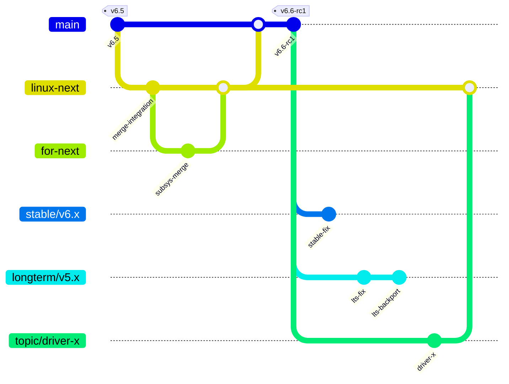

# Estructura y Gestión de Ramas en el Kernel de Linux

Breve resumen
- El kernel tiene varias ramas con roles claros: la rama principal (mainline) donde Linus integra los cambios, `linux-next` como integrador de parches de subsistemas, ramas de lanzamiento (rc), ramas `stable` para correcciones y ramas `longterm` (LTS) para soporte prolongado. Además hay ramas tópicas/por subsistema (topic/*, for-next/*) donde se preparan conjuntos de parches.

Flujo típico (resumen)
1. Desarrolladores envían parches a ramas topic/subsystem.
2. Los mantenedores consolidan y envían a `for-next` / `topic/*`.
3. `linux-next` integra ramas de subsistema para pruebas.
4. Linus mergea desde `linux-next` a `main` y crea release candidates (`vX.Y-rcN`).
5. Tras el lanzamiento, cambios críticos se aplican a `stable/vX.Y`.
6. Algunas versiones se marcan `longterm` para parches a largo plazo.

