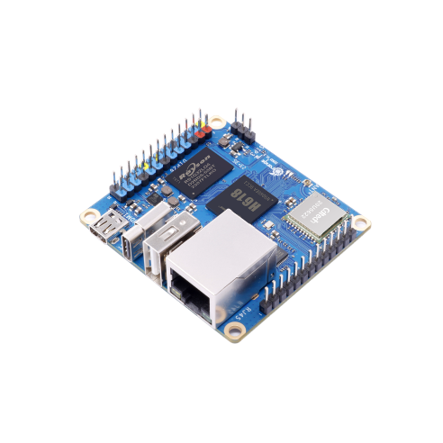

# Proyecto Linux Embebido en OrangePi Zero 3 - Allwinner H618

En esta guía aprenderemos a construir un sistema operativo Linux embebido en un OrangePi Zero 3 utilizando el procesador Allwinner H618.



## Primeros pasos
Para iniciar crea un directorio llamado `linux-dev` y cambia al directorio

```bash
mkdir linux-dev
cd linux-dev
```
A continuacion se enumeran la serie de pasos de desarrollo del proyecto:

## 1. Descargar repositorios

```bash
git clone https://github.com/u-boot/u-boot.git --depth 1
git clone https://github.com/ARM-software/arm-trusted-firmware.git --depth 1
git clone -b orange-pi-6.1-sun50iw9 https://github.com/orangepi-xunlong/linux-orangepi.git --depth 1

# O elige la rama orange-pi-5.13-sunxi64
```

## 2. Construir las imágenes Docker

```bash
docker build -t uboot-builder docker/
docker build -f docker/Dockerfile.kernel -t linux-kernel-dev docker/
```

## 3. Ejecutar contenedor con volumen montado

```bash
# Opción 1: Contenedor temporal
docker run -it --rm -v $PWD:/home/builder uboot-builder bash

# Opción 2: Contenedor persistente con uboot-builder
docker run -it --name linux-dev --privileged -v $PWD:/home/builder uboot-builder bash

# Opción 3: Contenedor persistente con linux-kernel-dev
docker run -it --name linux-dev --privileged -v $PWD:/home/builder linux-kernel-dev /bin/bash
```

### Iniciar el contenedor linux-dev existente

```bash
docker start -ai linux-dev
```

## 4. Compilación del bootloader

### Compilar ARM Trusted Firmware (ATF)

```bash
cd arm-trusted-firmware
make PLAT=sun50i_h616 bl31
```

### Copiar bl31.bin a la raíz de U-Boot

```bash
cp build/sun50i_h616/release/bl31.bin ../u-boot/
```

### Compilar U-Boot

```bash
cd ../u-boot
make orangepi_zero3_defconfig
make -j$(nproc) CROSS_COMPILE=aarch64-linux-gnu-
```

## 5. Grabar en la tarjeta SD

```bash
sudo dd if=u-boot-sunxi-with-spl.bin of=/dev/sdb bs=1024 seek=8 status=progress
sync
```

## 6. Debug y comunicación serial

### Verificar el dispositivo USB-Serial

```bash
sudo dmesg | grep -i tty
```

**Salida esperada:**

```
usb 3-2: ch341-uart converter now attached to ttyUSB0
```
!!! note "Nota"
    La salida puede variar porque el dispositivo USB-Serial puede tener diferentes nombres en diferentes sistemas.

### Conectar por serial

```bash
sudo screen /dev/ttyUSB0 115200
```

**Para salir de screen:** `Ctrl + A`, luego `k`

## 7. Compilación del kernel

### Compilar Device Tree

```bash
make ARCH=arm64 CROSS_COMPILE=aarch64-linux-gnu- \
  allwinner/sun50i-h618-orangepi-zero3.dtb
```

### Configurar el kernel

```bash
make ARCH=arm64 CROSS_COMPILE=aarch64-linux-gnu- linux_sunxi64_defconfig

# Para compilar y ver el menuconfig
make ARCH=arm64 CROSS_COMPILE=aarch64-linux-gnu- menuconfig
```

### Compilar el kernel

```bash
make -j$(nproc) ARCH=arm64 CROSS_COMPILE=aarch64-linux-gnu- Image modules
```

### Compilar todo junto (opción recomendada)

```bash
make -j$(nproc) ARCH=arm64 CROSS_COMPILE=aarch64-linux-gnu- Image dtbs modules
```

### Compilar boot.cmd

```bash
mkimage -C none -A arm64 -T script -d boot.cmd boot.scr
```

### Para instalar los modulos en rootfs

```bash
make ARCH=arm64 CROSS_COMPILE=aarch64-linux-gnu- modules_install INSTALL_MOD_PATH=/mnt/rootfs
```


[Recursos del proyecto](./resources.md)
