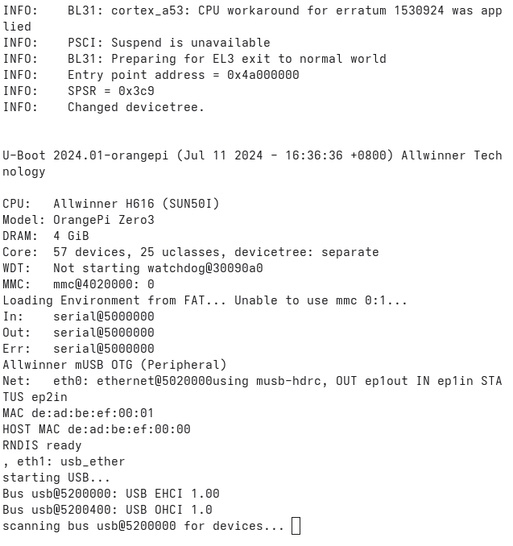

# Linux Embebido en OrangePi Zero 3 - Allwinner H618 usando Docker


En esta guía aprenderemos a construir un sistema operativo Linux embebido en un OrangePi Zero 3 utilizando el procesador Allwinner H618 utilizando contenedores de Docker.


## Primeros pasos

Para iniciar asegurate de tener `docker` instalado ademas de `git`.
Crea un directorio de trabajo llamado `linux-dev` o el nombre de tu preferencia y cambia al directorio.

```bash
mkdir linux-dev
cd linux-dev
```


A continuacion se enumeran la serie de pasos de desarrollo del proyecto:

## 1. Descargar repositorios

```bash
git clone https://github.com/u-boot/u-boot.git --depth 1
git clone https://github.com/ARM-software/arm-trusted-firmware.git --depth 1
git clone -b orange-pi-6.1-sun50iw9 https://github.com/orangepi-xunlong/linux-orangepi.git --depth 1

# O elige la rama orange-pi-5.13-sunxi64
```

Lista tu directorio para verificar el contenido.
```bash
# Comando para listar
ls
```

Deberias tener algo así:

```
  arm-trusted-firmware linux-orangepi u-boot
```
## 2. Construir las imágenes Docker

```bash
docker build -t uboot-builder docker/
docker build -f docker/Dockerfile.kernel -t linux-kernel-dev docker/
```

## 3. Ejecutar contenedor con volumen montado

```bash
# Opción 1: Contenedor temporal
docker run -it --rm -v $PWD:/home/builder uboot-builder bash

# Opción 2: Contenedor persistente con uboot-builder
docker run -it --name linux-dev --privileged -v $PWD:/home/builder uboot-builder bash

# Opción 3: Contenedor persistente con linux-kernel-dev
docker run -it --name linux-dev --privileged -v $PWD:/home/builder linux-kernel-dev /bin/bash
```

### Iniciar el contenedor linux-dev existente

Si creaste un contenedor persistente ejecuta este comando, cada que quieras interactuar con el, de lo contrario utiliza la `Opción 1` del paso anterior.

```bash
docker start -ai linux-dev
```

Cada que cierres o apagues el contenedor deberas iniciarlo como vimos anteriormente, los siguientes pasos se deben ejecutar cuando estes dentro de la instancia del contenedor de docker.

## 4. Compilación del bootloader

### Compilar ARM Trusted Firmware (ATF)

Entra a la carpeta `arm-trusted-firmware` y compila el proyecto.

```bash
cd arm-trusted-firmware

# Ejecuta make <argumentos de entorno ej. PLAT= > <binario a generar Ej. bl13>
make PLAT=sun50i_h616 bl31
```

Esto generara un archivo en esta ruta `build/sun50i_h616/release/bl31.bin`.

### Copiar bl31.bin a la raíz de U-Boot

```bash
cp build/sun50i_h616/release/bl31.bin ../u-boot/
```

Este paso es necesario para que no existan errores al compilar el U-Boot.

### Compilar U-Boot

Si estas en la carpeta `arm-trusted-firmware` ve hacia atrás y entra en la carpeta `u-boot`.

```bash
# Salir de la carpeta anterior y entrar a u-boot
cd ../u-boot

# Compilar U-Boot
make orangepi_zero3_defconfig
make -j$(nproc) CROSS_COMPILE=aarch64-linux-gnu-
```

## 5. Grabar en la tarjeta SD

A continuación presione `ctrl + d` para salir de tu contenedor, esto te dejara en la carpeta raiz de tu proyecto, asegurate de ingresar de nuevo a la carpeta `u-boot` y desde la terminal de tu computadora ejecuta el siguiente comando para grabar el binario que compilamos en tu tarjeta SD.

En la opción `of=/dev/sdx` cambia por la ruta de tu dispositivo real, ejemplo: `of=/dev/sdb`


!!! warning "Advertencia"
    ⚠️ Ten cuidado con este paso. Podrías dejar inutilizada tu PC si eliges el dispositivo equivocado.


```bash
sudo dd if=u-boot-sunxi-with-spl.bin of=/dev/sdx bs=1024 seek=8 status=progress
sync
```

## 6. Debug y comunicación serial

### Verificar el dispositivo USB-Serial

```bash
sudo dmesg | grep -i tty
```

**Salida esperada:**

```
usb 3-2: ch341-uart converter now attached to ttyUSB0
```
!!! note "Nota"
    La salida puede variar porque el dispositivo USB-Serial puede tener diferentes nombres en diferentes sistemas.

### Conectar por serial

```bash
sudo screen /dev/ttyUSB0 115200
```

Conecta la placa a la corriente y si todo salió bien deberias darte algo parecido a la siguiente salida por terminal.



Ahora si ya tenemos el bootlader grabado y funcional en nuestra SD.

**Para salir de screen:** `Ctrl + A`, luego `k`.

## 7. Compilación del kernel

### Compilar Device Tree

```bash
make ARCH=arm64 CROSS_COMPILE=aarch64-linux-gnu- \
  allwinner/sun50i-h618-orangepi-zero3.dtb
```

### Configurar el kernel

```bash
make ARCH=arm64 CROSS_COMPILE=aarch64-linux-gnu- linux_sunxi64_defconfig

# Para compilar y ver el menuconfig
make ARCH=arm64 CROSS_COMPILE=aarch64-linux-gnu- menuconfig
```

### Compilar el kernel

```bash
make -j$(nproc) ARCH=arm64 CROSS_COMPILE=aarch64-linux-gnu- Image modules
```

### Compilar todo junto (opción recomendada)

```bash
make -j$(nproc) ARCH=arm64 CROSS_COMPILE=aarch64-linux-gnu- Image dtbs modules
```

### Compilar boot.cmd

```bash
mkimage -C none -A arm64 -T script -d boot.cmd boot.scr
```

### Para instalar los modulos en rootfs

```bash
make ARCH=arm64 CROSS_COMPILE=aarch64-linux-gnu- modules_install INSTALL_MOD_PATH=/mnt/rootfs
```
