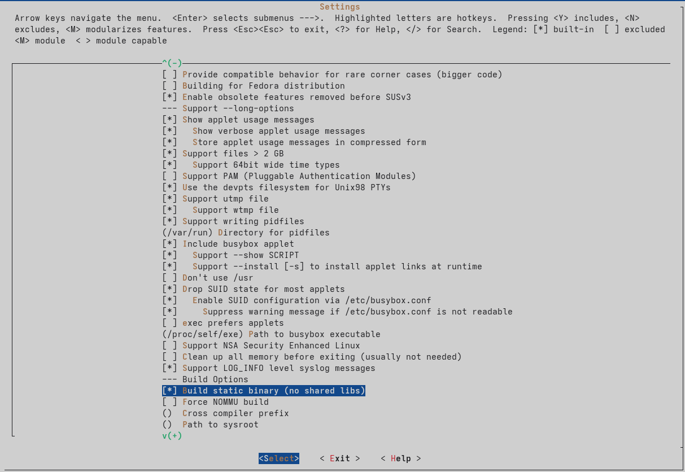
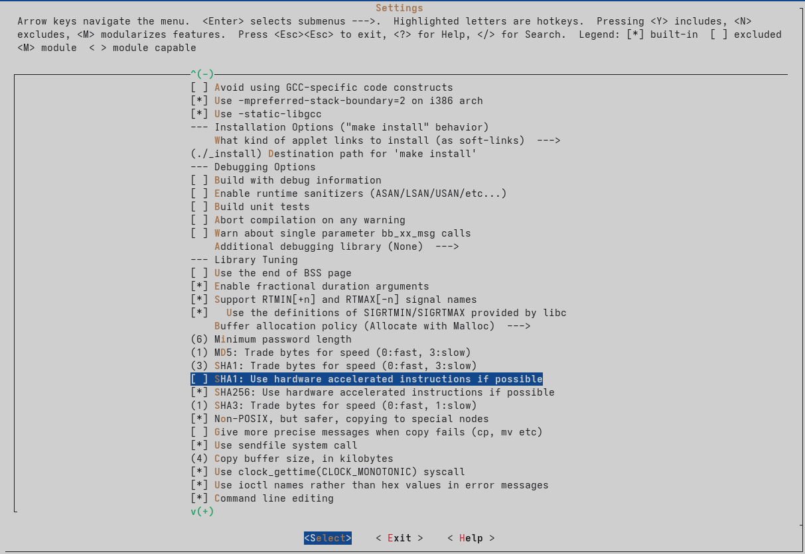

# Segunda parte del proyecto Linux Embebido en OrangePi Zero 3 - Allwinner H618 usando Docker

Aqui se continuará con la guia de desarrollo de Linux Embebido en la OrangePi Zero 3, en la sección anterior preparamos el entorno de trabajo y compilamos los dos primeros componentes del sistema:

* U-Boot (bootloader)
* Kernel de Linux

En esta ocasión nos centraremos en crear un `rootfs` que será nuestro sistema de archivos raíz donde formaremos la arquitectura de directorios convencional de Linux, ya agregremos el sistema de arranque y porgramas básicos apyandonos del proyecto **Busybox**.


## Estructura principal

Nos dirigeremos a nuestra carpeta principal del proyecto, y crearemos el directorio raíz `rootfs`

```bash
mkdir -p rootfs
```

Las carpetas se verian asi:

```
  arm-trusted-firmware linux-orangepi rootfs u-boot
```

Despues entramos a este nuevo directorio.

```bash
cd rootfs
```

Creamos la estructura de directorios

```bash
mkdir -p {dev,proc,sys,etc,bin,sbin,tmp,usr/{bin,sbin},var,home}
chmod 1777 tmp
```

Creamos dispositivos basicos en `dev`.

Estando dentro de `rootfs` nos dirigimos a la capeta `dev` creada en el paso anterior, y ahí creamos los dispositivos principales.

```bash
cd dev
sudo mknod -m 622 console c 5 1
sudo mknod -m 666 null c 1 3
```

Estos dispositivos son necesarios para el funcionamiento de nuestro sistema, de lo contrario no podrá arrancar.

## Busybox

Ahora volvemos a la raiz de nuestro proyecto y descargaremos busybox desde su repositorio.

```bash
git clone https://github.com/mirror/busybox.git --depth 1
cd busybox
```

Esto descargará el proyecto y nos pondrá dentro del directorio.

El siguiente paso es crear la configuración.


```bash
make defconfig
make menuconfig
```

Dentro del menu editamos la configuración, debemos activar la compilación estatica para no tener problema de dependencias.

```
Settings → Build static binary (no shared libs)
```

La activamos dando la tecla `[space]`.



Tambien debemos desactivar la opcion de aceleración SHA1.



Salimos y guardamos.

### Iniciamos la compilación

El proceso puede durar algunos minutos dependiendo de tu maquina.

```bash
make ARCH=arm64 CROSS_COMPILE=aarch64-linux-gnu- -j$(nproc)
```

Si el proceso fue exitoso instalamos busybox en nuestro `rootfs`.

!!! note "Nota"
    Asegurate que la ruta del rootfs sea la correcta, de lo contrario podria no instalarse o crear problemas.

```bash
make ARCH=arm64 CROSS_COMPILE=aarch64-linux-gnu- INSTALL_MOD_PATH=../rootfs-arm64 modules_install
```
Ahora en nuestro directorio `rootfs` deberiamos tener instalado busybox, puedes comprobarlo, deberias tener este archivo.

```
rootfs/bin/busybox
```

## Creando el Init

Dentro de tu `rootfs`, crea un archivo init en la raiz principal.

```bash
cd rootfs
touch init
```

Ahora abrimos con el editor este archivo y agregamos el siguiente contenido inicial.

```
#!/bin/sh
# Montar sistemas de archivos necesarios
mount -t proc proc /proc
mount -t sysfs sysfs /sys
mount -t devtmpfs devtmpfs /dev

# Mensaje de inicio
echo "Iniciando sistema..."

# Lanzar shell interactiva
exec /bin/sh
```

Este script sera el proceso principal con el cual vamos a interactuar.

Hacemos el `init` ejecutable.

```bash
chmod +x init
```


## Instalando modulos del kernel en el rootfs

Nos dirigimos a la carpeta `linux-orangepi` y ejecutamos el siguiente comando, de la misma manera debemos asegurarnos que la ruta del `rootfs` sea la correcta

```bash
make ARCH=arm64 CROSS_COMPILE=aarch64-linux-gnu- modules_install INSTALL_MOD_PATH=../rootfs
```

## Próximos pasos

En la siguiente sección veremos como crear la configuracion para el aranque y empaquetar todo para tener nuestro sistema Linux embebido listo para ejecutar en nuestra OrangePi Zero 3.


<!-- ## Compilar boot.cmd

```bash
mkimage -C none -A arm64 -T script -d boot.cmd boot.scr
``` -->
