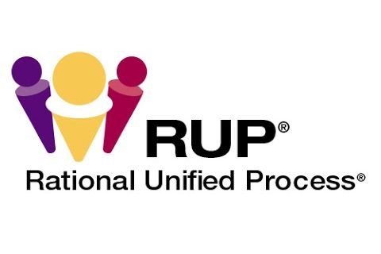

# Rational Unified Process (RUP)

**Rational Unified Process (RUP)**, o Proceso Unificado de Rational, es un enfoque metodológico para el desarrollo de software que proporciona una estructura y guía para gestionar todo el ciclo de vida del desarrollo de software. RUP busca producir software de alta calidad de manera predecible y controlada.

RUP se organiza en **cinco etapas principales**, que ayudan a planificar, diseñar, implementar y validar el software de manera iterativa y progresiva.

---

## 1. Inicio (Inception)

La fase de **Inicio** se centra en definir el alcance del proyecto y sus objetivos principales.
En esta etapa se realizan actividades como:

- Identificación de los requisitos más importantes.
- Definición de los actores principales y casos de uso.
- Evaluación de riesgos iniciales.
- Estimación de recursos, costos y tiempos.
- Creación de un plan de proyecto preliminar.

El objetivo principal de esta fase es **asegurar que el proyecto es viable y que los stakeholders están alineados**.

---

## 2. Elaboración (Elaboration / Análisis)

Durante la fase de **Elaboración**, se profundiza en los requisitos y se define la arquitectura del sistema.

Actividades clave:

- Refinamiento de requisitos y casos de uso.
- Análisis de riesgos detallado.
- Diseño de la arquitectura básica del software.
- Preparación de un plan de desarrollo detallado.
- Validación temprana de la viabilidad técnica.

Esta fase busca **establecer una base sólida para el desarrollo y minimizar riesgos futuros**.

---

## 3. Construcción (Construction / Diseño e Implementación)

La fase de **Construcción** está dedicada a **desarrollar y construir el sistema** siguiendo la arquitectura definida.

Actividades principales:

- Diseño detallado de componentes y módulos.
- Implementación del código fuente.
- Integración de componentes.
- Pruebas unitarias y de integración.
- Gestión continua de la configuración.

El objetivo es **producir un sistema completo y funcional listo para pruebas más exhaustivas**.

---

## 4. Pruebas (Transition / Verificación y Validación)

La fase de **Pruebas o Transición** se centra en **validar que el sistema cumple con los requisitos y está listo para su despliegue**.

Actividades:

- Pruebas de aceptación por el usuario.
- Corrección de defectos encontrados durante la prueba.
- Ajustes de rendimiento y optimización.
- Preparación de la documentación final del usuario.
- Capacitación a usuarios finales si es necesario.

Se busca **garantizar la calidad y satisfacción del cliente antes del lanzamiento**.

---

## 5. Mantenimiento (Maintenance)

Aunque RUP formalmente tiene cuatro fases principales, el **mantenimiento** es un proceso continuo posterior al despliegue:

- Corrección de errores encontrados en producción.
- Mejoras y actualizaciones del sistema.
- Adaptación a nuevos requisitos o cambios tecnológicos.
- Gestión de la configuración y versiones futuras.

El objetivo es **mantener el sistema operativo y evolucionar con las necesidades del negocio**.

---

## Características clave de RUP

- **Iterativo e incremental:** El desarrollo se realiza en ciclos, permitiendo ajustes tempranos.
- **Orientado a casos de uso:** Los requisitos se documentan como casos de uso que guían el desarrollo.
- **Gestión de riesgos:** Identificación y mitigación de riesgos desde el inicio.
- **Documentación controlada:** RUP define artefactos y plantillas para estandarizar el proceso.