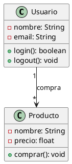
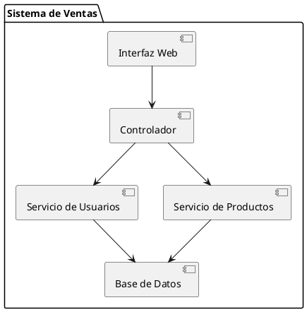
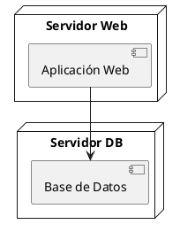
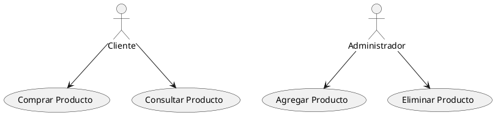
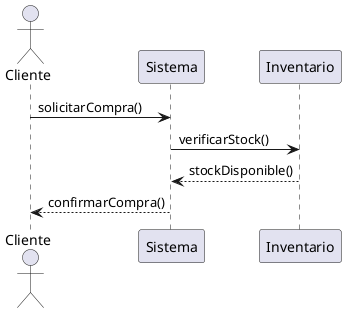
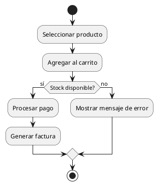
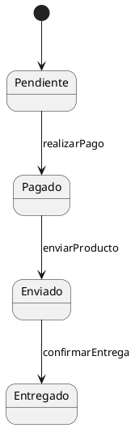

# Introducción a UML y Diagramas con PlantUML

UML (Unified Modeling Language) es un lenguaje gráfico estandarizado para visualizar, especificar, construir y documentar sistemas de software. UML permite representar distintos aspectos de un sistema mediante diagramas, que se agrupan en diagramas estructurales y diagramas de comportamiento.

A continuación se incluyen ejemplos prácticos usando PlantUML.

---

## 1. Diagramas Estructurales

### 1.1 Diagrama de Clases


```uml
@startuml
class Usuario {
    -nombre: String
    -email: String
    +login(): boolean
    +logout(): void
}

class Producto {
    -nombre: String
    -precio: float
    +comprar(): void
}

Usuario "1" --> "*" Producto : compra
@enduml
```


---

### 1.2 Diagrama de Componentes



```uml
@startuml
package "Sistema de Ventas" {
    [Interfaz Web] --> [Controlador]
    [Controlador] --> [Servicio de Usuarios]
    [Controlador] --> [Servicio de Productos]
    [Servicio de Usuarios] --> [Base de Datos]
    [Servicio de Productos] --> [Base de Datos]
}
@enduml
```

---

### 1.3 Diagrama de Despliegue (Deployment)



```uml
@startuml
node "Servidor Web" {
    [Aplicación Web]
}
node "Servidor DB" {
    [Base de Datos]
}
[Aplicación Web] --> [Base de Datos]
@enduml
```

---

## 2. Diagramas de Comportamiento

### 2.1 Diagrama de Casos de Uso



```uml
@startuml
actor Cliente
actor Administrador

Cliente --> (Comprar Producto)
Cliente --> (Consultar Producto)
Administrador --> (Agregar Producto)
Administrador --> (Eliminar Producto)
@enduml
```

---

### 2.2 Diagrama de Secuencia



```uml
@startuml
actor Cliente
participant Sistema
participant Inventario

Cliente -> Sistema : solicitarCompra()
Sistema -> Inventario : verificarStock()
Inventario --> Sistema : stockDisponible()
Sistema --> Cliente : confirmarCompra()
@enduml
```

---

### 2.3 Diagrama de Actividad


```uml
@startuml
start
:Seleccionar producto;
:Agregar al carrito;
if (Stock disponible?) then (sí)
  :Procesar pago;
  :Generar factura;
else (no)
  :Mostrar mensaje de error;
endif
stop
@enduml
```


---

### 2.4 Diagrama de Estados


```uml
@startuml
[*] --> Pendiente

Pendiente --> Pagado : realizarPago
Pagado --> Enviado : enviarProducto
Enviado --> Entregado : confirmarEntrega
@enduml
```
